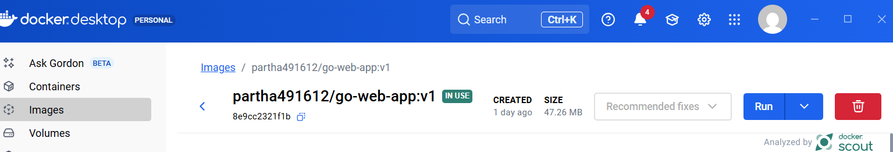
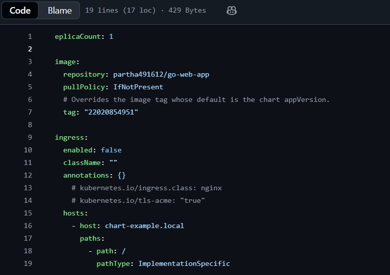
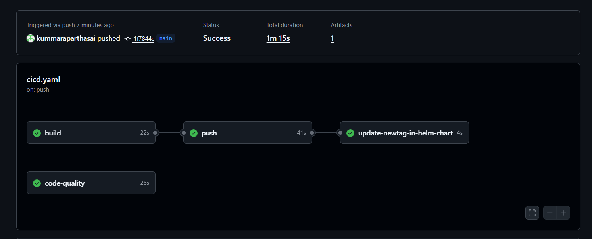
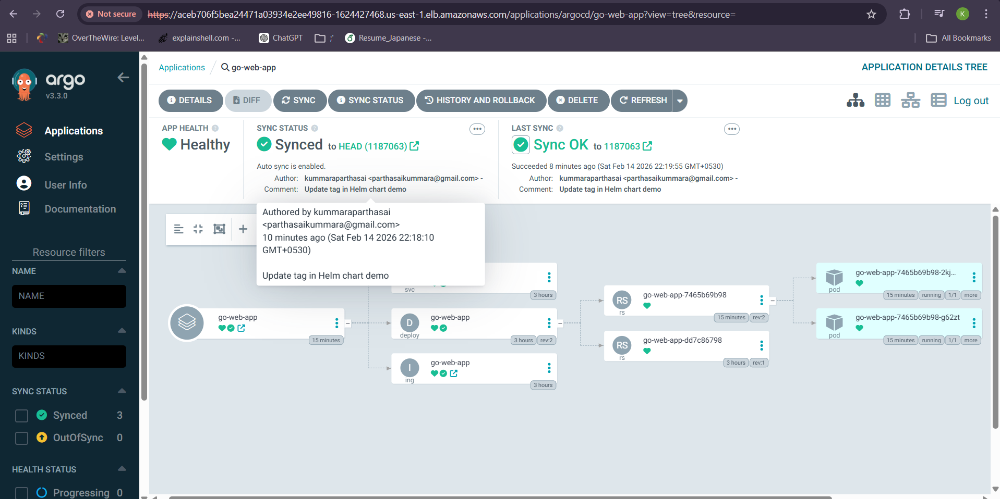

docker push partha491612/go-web-app:22020854951
```

---

## 📸 Docker Hub Repository

<p align="center">
  
</p>

---


# ☸️ Step 3: Deploying to Amazon EKS

The Kubernetes cluster was created using:


```bash
eksctl create cluster --name demo-cluster --region us-east-1
```

---

## 📦 Running Pods

```bash
kubectl get pods
```

Pods are successfully running inside the cluster.

<p align="center">
  
</p>


## 🌐 Kubernetes Services

```bash
kubectl get svc
```

Service exposes the application via NodePort / LoadBalancer.

<p align="center">
  
</p>

---

# 📦 Step 4: Helm Chart Integration

Helm is used to manage Kubernetes manifests efficiently.

---

## 🔄 values.yaml Configuration

```yaml
image:
  repository: partha491612/go-web-app
  tag: "22020854951"
  pullPolicy: IfNotPresent
```

The Docker image tag is dynamically updated during CI pipeline execution.

---

## 📸 Helm Image Tag Update

<p align="center">
  
</p>

---

# ⚙️ Step 5: CI/CD Pipeline (GitHub Actions)

On every push to the `main` branch, the pipeline performs:

### 🔁 Pipeline Stages

1️⃣ Code Quality Check
2️⃣ Docker Build
3️⃣ Docker Push
4️⃣ Helm Chart Tag Update

---

## ✅ CI/CD Success

Pipeline executed successfully.

<p align="center">
  
</p>

---

# 🔄 Step 6: GitOps Deployment using ArgoCD

ArgoCD continuously monitors the Git repository.

When Helm chart image tag changes:

- ArgoCD detects changes
- Syncs automatically
- Deploys updated version to EKS cluster

---

## 📊 ArgoCD Dashboard

- 💚 Application Health: Healthy
- 🔄 Sync Status: Synced
- ✔️ Last Sync: Successful

<p align="center">
  
</p>

---

# 🌍 Step 7: Final Production Output

Application successfully deployed via:

```
EKS → Pods → Service → Load Balancer → Public URL
```

---

## 📸 Live Application

<p align="center">
  
</p>

---

# 📌 Project Status

✔ Application Running
✔ Pods Healthy
✔ CI/CD Successful
✔ ArgoCD Synced
✔ Production Ready 🚀

                                                                                                                                                                                                                                                                                                                                                                                                                                                                                                                                                                                                                                                                                                                                                                                                                                                                                                                                                                                                                                                                                                                                                                                                                                                                                                                                                                                                                                                                                                                                                                                                                                                                                                                                                                                                                                                                                                                         55,0-1 Bot
